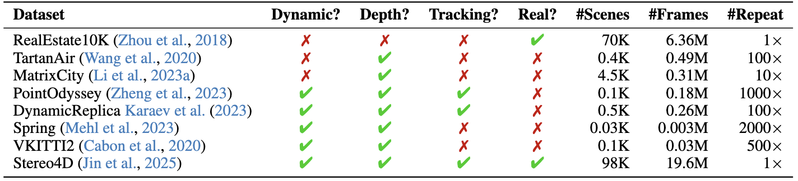

# 🎞️MoVieS

<p align="center">
  <font size="+3"><strong>MoVieS: Motion-Aware 4D Dynamic View Synthesis in One Second</strong></font>
</p>

<h4 align="center">

[Chenguo Lin<sup>1*</sup>](https://chenguolin.github.io), [Yuchen Lin<sup>1,3*</sup>](https://wgsxm.github.io), [Panwang Pan<sup>2†</sup>](https://paulpanwang.github.io),<br>[Yifan Yu<sup>2</sup>](https://scholar.google.com/citations?user=S2OksN4AAAAJ), [Honglei Yan<sup>2</sup>](https://openreview.net/profile?id=~Honglei_Yan1), [Katerina Fragkiadaki<sup>3</sup>](https://www.cs.cmu.edu/~katef/), [Yadong Mu<sup>1</sup>](http://www.muyadong.com)

<sup>1</sup>Peking University, <sup>2</sup>ByteDance, <sup>3</sup>Carnegie Mellon University

[](https://arxiv.org/abs/2507.10065)
[](https://chenguolin.github.io/projects/MoVieS)
[](https://www.youtube.com/watch?v=pNfmIchMji8)

<p>
    
</p>

</h4>

This repository contains the official implementation of the paper: [MoVieS: Motion-Aware 4D Dynamic View Synthesis in One Second](https://arxiv.org/abs/2507.10065).
MoVieS is a feed-forward framework that jointly reconstructs appearance, geometry and motion for 4D scene perception from monocular videos in one second.

Feel free to contact me (chenguolin@stu.pku.edu.cn) or open an issue if you have any questions or suggestions.


## 📢 News

- **2025-07-15**: This repo is initialized and MoVieS technical report is released on arXiv.


## 📋 TODO

- [ ] Provide source codes for inference and training.
- [ ] Provide the pretrained checkpoint at `224x224` resolution.
- [ ] Provide the pretrained checkpoint at `518x518` resolution.
- [ ] Provide detailed instructions for inference and training.
- [ ] Provide pre-processing scripts for training datasets.


## 🔧 Installation

You may need to modify the specific version of `torch` in `settings/setup.sh` according to your CUDA version.
There are not restrictions on the `torch` version, feel free to use your preferred one.
```bash
git clone https://github.com/chenguolin/MoVieS.git
cd MoVieS
bash settings/setup.sh
```


## 📊 Dataset



- We use three static scene datasets ([RealEstate10K](https://google.github.io/realestate10k), [TartanAir](https://theairlab.org/tartanair-dataset) and [MatrixCity](https://city-super.github.io/matrixcity)) and five dynamic scene datasets ([PointOdyssey](https://pointodyssey.com), [DynamicReplica](https://dynamic-stereo.github.io), [Spring](https://spring-benchmark.org), [VKITTI2](https://europe.naverlabs.com/proxy-virtual-worlds-vkitti-2) and [Stereo4D](https://stereo4d.github.io)) to train MoVieS.
- We will provide pre-processing scripts to these datasets soon. Please stay tuned or open an issue to push me to hurry up 😃.


## 🚀 Usage

- TODO


## 😊 Acknowledgement
We would like to thank the authors of [DiffSplat](https://github.com/chenguolin/DiffSplat), [VGGT](https://github.com/facebookresearch/vggt), [NoPoSplat](https://github.com/cvg/NoPoSplat), and [CUT3R](https://github.com/CUT3R/CUT3R) for their great work and generously providing source codes, which inspired our work and helped us a lot in the implementation.


## 📚 Citation
If you find our work helpful, please consider citing:
```bibtex
@article{lin2025movies,
  title={MoVieS: Motion-Aware 4D Dynamic View Synthesis in One Second},
  author={Lin, Chenguo and Lin, Yuchen and Pan, Panwang and Yu, Yifan and Yan, Honglei and Fragkiadaki, Katerina and Mu, Yadong},
  journal={arXiv preprint arXiv:2507.10065},
  year={2025}
}
```
