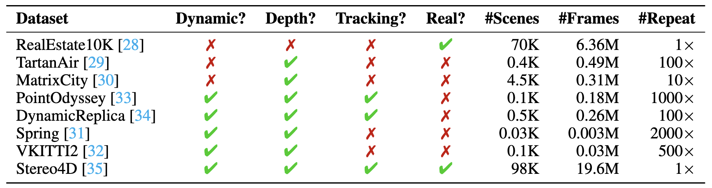

# [CVPR 2026] 🎞️MoVieS

<p align="center"> 
  <a href="https://chenguolin.github.io/projects/MoVieS" style="text-decoration: none"><font size="+4"><strong>MoVieS: Motion-Aware 4D Dynamic View Synthesis in One Second</strong></font></a> 
 </p> 

<h4 align="center">

[Chenguo Lin<sup>1*</sup>](https://chenguolin.github.io), [Yuchen Lin<sup>1,3*</sup>](https://wgsxm.github.io), [Panwang Pan<sup>2†</sup>](https://paulpanwang.github.io),<br>[Yifan Yu<sup>2</sup>](https://scholar.google.com/citations?user=S2OksN4AAAAJ), [Tao Hu<sup>2</sup>](https://tau-yihouxiang.github.io), [Honglei Yan<sup>2</sup>](https://openreview.net/profile?id=~Honglei_Yan1), [Katerina Fragkiadaki<sup>3</sup>](https://www.cs.cmu.edu/~katef), [Yadong Mu<sup>1</sup>](http://www.muyadong.com)

<sup>1</sup>Peking University, <sup>2</sup>ByteDance, <sup>3</sup>Carnegie Mellon University

[](https://arxiv.org/abs/2507.10065)
[](https://chenguolin.github.io/projects/MoVieS)
[](https://www.youtube.com/watch?v=Dgcaj8TkjZs)
[](https://huggingface.co/chenguolin/MoVieS)

<p>
    
</p>

</h4>

This repository contains the official implementation of the paper: [MoVieS: Motion-Aware 4D Dynamic View Synthesis in One Second](https://arxiv.org/abs/2507.10065).
MoVieS is a feed-forward framework that jointly reconstructs appearance, geometry and motion for 4D scene perception from monocular videos in one second.

Feel free to contact me (chenguolin@stu.pku.edu.cn) or open an issue if you have any questions or suggestions.


## 🔥 See Also
You may also be interested in our other works:
- [**[CVPR 2026] Diff4Splat**](https://github.com/paulpanwang/Diff4Splat): a generative model for 4D dynamic scenes from a single-view image.


## 📢 News

- **2026-02-26**: The source codes for inference and training, and pretrained checkpoint are released.
- **2026-02-21**: The paper is accepted to CVPR 2026.
- **2025-07-15**: This repo is initialized and MoVieS technical report is released on arXiv.


## 📋 TODO

- [x] Provide source codes for inference and training.
- [x] Provide the pretrained checkpoint.
- [ ] Provide detailed instructions for inference and training.


## 🔧 Installation

You may need to modify the specific version of `torch` in `settings/setup.sh` according to your CUDA version.
There are not restrictions on the `torch` version, feel free to use your preferred one.
```bash
conda create -n movies python=3.10 -y
conda activate movies
git clone https://github.com/chenguolin/MoVieS.git
cd MoVieS
bash settings/setup.sh
```


## 🚀 Inference Usage

### 📸 Novel View Synthesis

#### In-the-wild DAVIS dataset
1. Download the pretrained checkpoint and preprocessed videos with poses from [🤗HuggingFace](https://huggingface.co/chenguolin/MoVieS) and put them in `resources/`. In-the-wild videos are provided by the [DAVIS dataset](https://davischallenge.org/davis2016/code.html), and their camera poses are estimated by [MegaSAM](https://github.com/mega-sam/mega-sam).
```bash
mkdir -p resources && cd resources
hf download chenguolin/MoVieS movies_ckpt.safetensors DAVIS/ --local-dir resources
```

2. Run the inference script for novel view synthesis. In the inference script, we first render the dynamic scene with a fixed camera, and then fix the timestamp and render the scene with a moving camera to synthesis novel views. You can also apply other desired combinations of camera poses and timestamps for novel view rendering.
```bash
# python src/infer_davis_nvs.py --name <DAVIS_SAMPLE_NAME>
# For example:
python src/infer_davis_nvs.py --name motocross-bumps
```
Inference results will be saved in `out/<DAVIS_SAMPLE_NAME>`. You will get:
| **Input Video** (`input_video.mp4`) | **Predicted Motion** (`output_motion_camera0.mp4`) | **Novel View Synthesis** (`output_render.mp4`) |
|:-:|:-:|:-:|
|  |  |  |

### 📍 3D Point Tracking

- TODO

### 🌊 Scene Flow Estimation

- TODO

### ✂️ Dynamic Object Segmentation

- TODO


## 🏋️‍♂️ Training Usage

### 📊 Training Datasets



- We use three static scene datasets ([RealEstate10K](https://google.github.io/realestate10k), [TartanAir](https://theairlab.org/tartanair-dataset) and [MatrixCity](https://city-super.github.io/matrixcity)) and five dynamic scene datasets ([PointOdyssey](https://pointodyssey.com), [DynamicReplica](https://dynamic-stereo.github.io), [Spring](https://spring-benchmark.org), [VKITTI2](https://europe.naverlabs.com/proxy-virtual-worlds-vkitti-2) and [Stereo4D](https://stereo4d.github.io)) to train MoVieS.
- Support combining multiple datasets for training via `src/data/easy_dataset.py`.
- Support dynamic number of input frames and aspect ratios via `src/data/dynamic_dataloader.py`.
- Set your dataset directory in `src/options.py` before training.

### 🧑‍🏫 Training Instructions

- TODO


## 😊 Acknowledgement
We would like to thank the authors of [DiffSplat](https://github.com/chenguolin/DiffSplat), [VGGT](https://github.com/facebookresearch/vggt), [NoPoSplat](https://github.com/cvg/NoPoSplat), and [CUT3R](https://github.com/CUT3R/CUT3R) for their great work and generously providing source codes, which inspired our work and helped us a lot in the implementation.


## 📚 Citation
If you find our work helpful, please consider citing:
```bibtex
@inproceedings{lin2026movies,
  title={MoVieS: Motion-Aware 4D Dynamic View Synthesis in One Second},
  author={Lin, Chenguo and Lin, Yuchen and Pan, Panwang and Yu, Yifan and and Hu, Tao and Yan, Honglei and Fragkiadaki, Katerina and Mu, Yadong},
  booktitle={Proceedings of the Computer Vision and Pattern Recognition Conference (CVPR)},
  year={2026}
}
```
